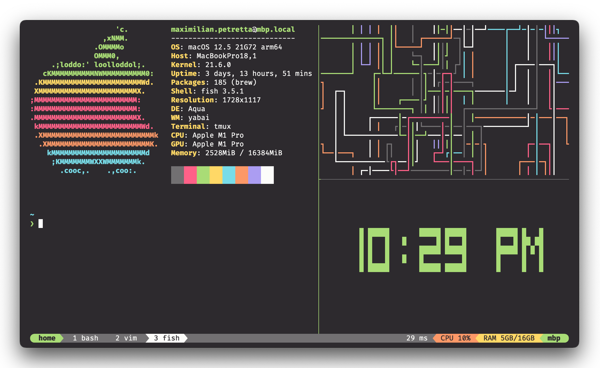

# Monokai Pro for tmux

A customized version of the [Dracula theme](https://github.com/dracula/tmux) for [tmux](https://github.com/tmux/tmux/wiki), using colors from [Monokai Pro](https://monokai.pro/).



## Install

Using [tpm](https://github.com/tmux-plugins/tpm), add the following to your `.tmux.conf`:

```
set -g @plugin 'maxpetretta/tmux-monokai-pro'
```

## Configuration

Configuration and options can be found at [draculatheme.com/tmux](https://draculatheme.com/tmux).

**NOTE**: Replace all mentions of `@dracula` with `@monokai`

## Compatibility

Tested on macOS Monterey, with & without powerline symbols

## License

[MIT License](./LICENSE)

## Credits

All credit goes to [dracula/tmux](https://github.com/dracula/tmux), which this theme was forked from

Special thanks to [Monokai](https://monokai.nl/) for creating the One True Color Theme <3
